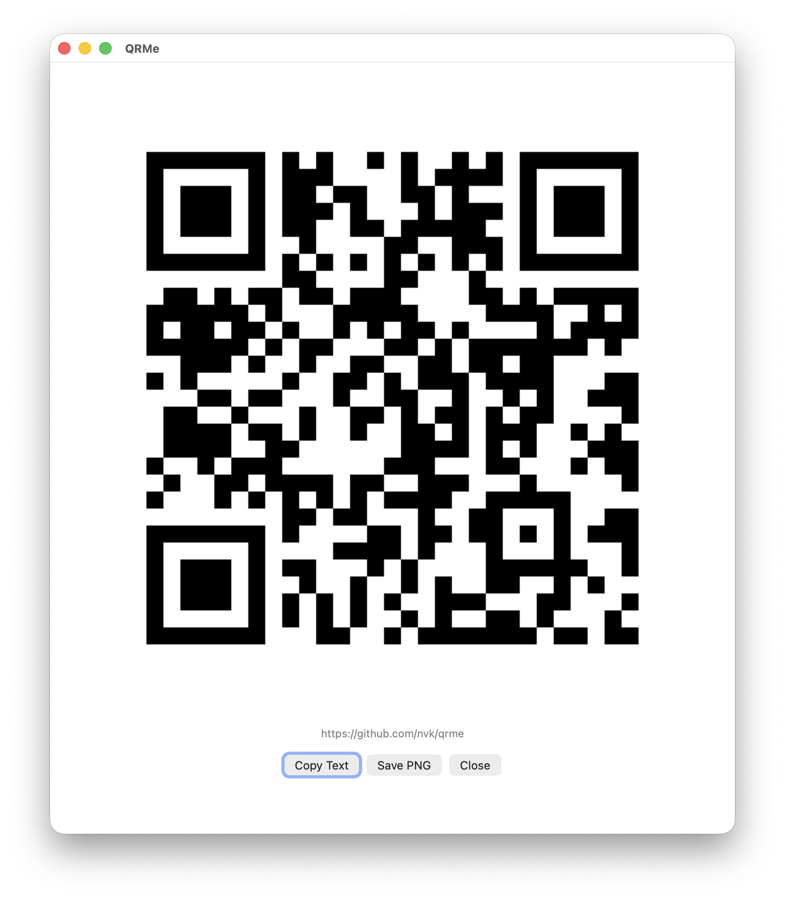

# QRMe

QRMe is a small macOS Services-menu app. Select text in another app, choose `Services > QRMe`, and QRMe opens a window with the selected text encoded as a QR code.

QRMe runs locally. It does not send selected text over the network, and it does not replace the selected text.



## Install from a Release

1. Download `QRMe.service.zip` from the latest GitHub release.
2. Unzip it.
3. Move `QRMe.service` to `~/Library/Services/`.
4. Select text in another app and choose `Services > QRMe`.

If macOS blocks the downloaded service because it is unsigned, build from source instead. Source-built services are the recommended path for now.

## Build the Service Bundle

```sh
./scripts/build-service.sh
```

The service bundle is created at `build/QRMe.service`.

## Install for the Current User

```sh
./scripts/install-service.sh
```

This copies the service to `~/Library/Services/QRMe.service` and asks macOS to refresh the Services menu.

To uninstall:

```sh
./scripts/uninstall-service.sh
```

## Use

1. Select text in an app such as TextEdit, Safari, Notes, or Mail.
2. Right-click the selected text.
3. Choose `Services > QRMe`.
4. Scan the QR code from the QRMe window.

macOS and the host app decide whether a Service appears directly in the contextual menu or under `Services`.

## Development Checks

```sh
swift build --disable-sandbox
swift run --disable-sandbox QRMe --self-test
./scripts/package-release.sh
```

## Notes

- Very large selections are rejected because they produce QR codes that are difficult or impossible to scan reliably.
- QR encoding uses the MIT-licensed `fwcd/swift-qrcode-generator` package, derived from Project Nayuki's QR Code generator.

## License

MIT. See `LICENSE`.
